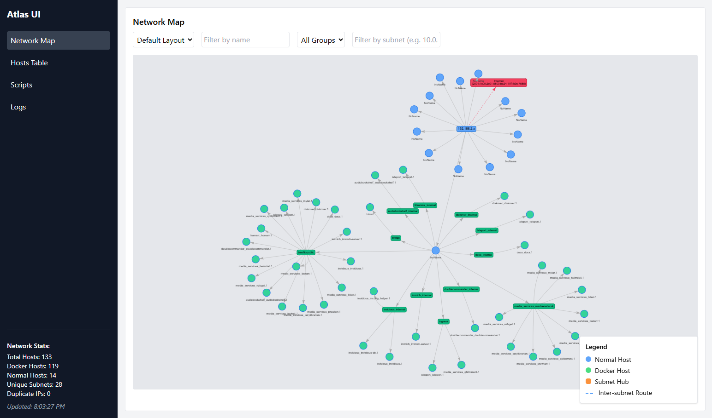
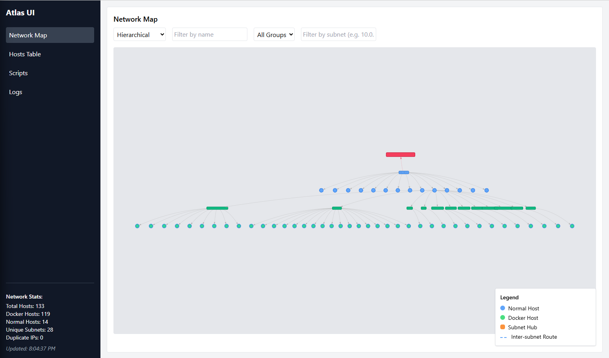
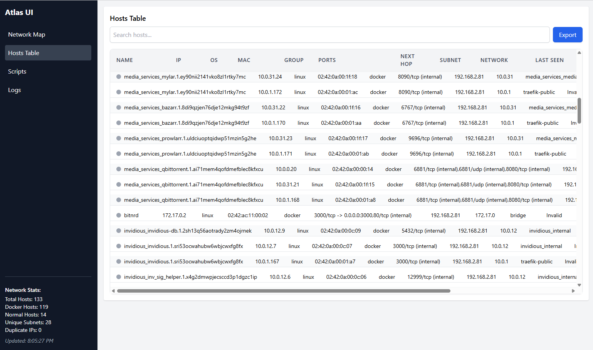
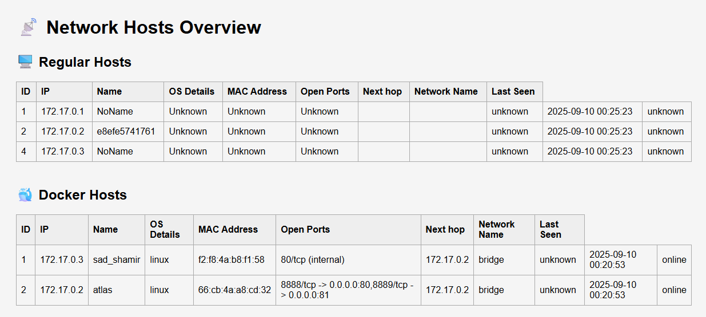
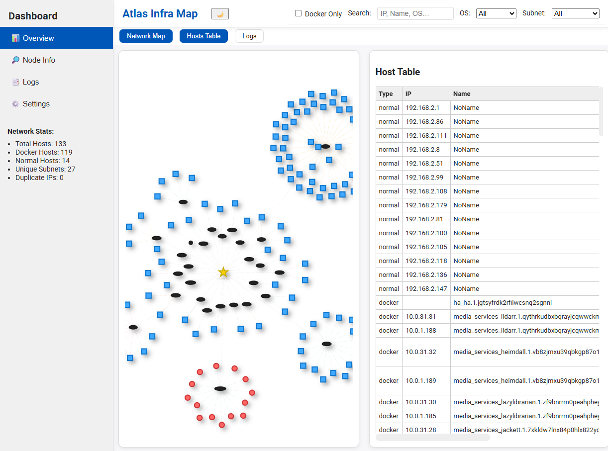

# 🌐 Atlas - Network Infrastructure Visualizer (Go-powered)

**Atlas** is a full-stack containerized tool to **scan**, **analyze**, and **visualize** network infrastructure dynamically. Built with Go, FastAPI, NGINX, and a custom React frontend, it provides automated scanning, storage, and rich dashboards for insight into your infrastructure.

---
### Live Demo 🔗 [atlasdemo.vnerd.nl](https://atlasdemo.vnerd.nl/)

---
## 🚀 What It Does

Atlas performs three key functions:

1. **Scans Docker Containers** running on the host to extract:
   - IP addresses
   - MAC addresses
   - Open ports
   - Network names
   - OS type (from image metadata)

2. **Scans Local & Neighboring Hosts** on the subnet to:
   - Detect reachable devices
   - Retrieve OS fingerprints, MACs, and open ports
   - Populate a full map of the infrastructure

3. **Visualizes Data in Real-Time**:
   - Serves an interactive HTML dashboard via Nginx
   - Hosts a FastAPI backend for data access and control
   - Uses a React frontend to render dynamic network graphs

---

## 🖼️ Screenshots

### Dashboard View

<div style="display: flex; gap: 24px; flex-wrap: wrap;">
  <a href="screenshots/network-map-1.png" target="_blank">
    
  </a>
  <a href="screenshots/network-map-2.png" target="_blank">
    
  </a>
</div>

### Hosts Table

<div style="display: flex; gap: 24px; flex-wrap: wrap;">
  <a href="screenshots/hosts-table-1.png" target="_blank">
    
  </a>
  <a href="screenshots/hosts-table-2.png" target="_blank">
    
  </a>
</div>

### Vis Dashboard (dev)

<div style="display: flex; gap: 24px; flex-wrap: wrap;">
  <a href="screenshots/vis.png" target="_blank">
    
  </a>
</div>

---

## 🚀 Deployment (Docker)

Atlas now exposes both the UI and API ports via environment variables so you can align them with your host policies:

- `ATLAS_UI_PORT` – default `8888`
- `ATLAS_API_PORT` – default `8889`

Static HTML assets are compiled during the Docker build, so no manual `npm run build` step is required before running a container.

### Quick start (host networking)

```bash
docker run -d \
  --name atlas \
  --network=host \
  --cap-add=NET_RAW \
  --cap-add=NET_ADMIN \
  -v /var/run/docker.sock:/var/run/docker.sock \
  -e ATLAS_UI_PORT=8888 \
  -e ATLAS_API_PORT=8889 \
  keinstien/atlas:latest
```

### Custom ports with bridge networking

```bash
docker run -d \
  --name atlas \
  --cap-add=NET_RAW \
  --cap-add=NET_ADMIN \
  -v /var/run/docker.sock:/var/run/docker.sock \
  -e ATLAS_UI_PORT=3000 \
  -e ATLAS_API_PORT=3001 \
  -p 3000:3000 \
  -p 3001:3001 \
  keinstien/atlas:latest
```

📌 At container start the Go scanners run automatically and Atlas begins discovering your environment right away.

---

## ⚙️ How it Works

### 🔹 Backend Architecture

- **Go CLI (`atlas`)**
  - Built using Go 1.22
  - Handles:
    - `initdb`: Creates SQLite DB with required schema
    - `fastscan`: Fast host scan using ARP/Nmap
    - `dockerscan`: Gathers Docker container info from `docker inspect`
    - `deepscan`: Enriches data with port scans, OS info, etc.

- **FastAPI Backend**
  - Runs on the port set via `ATLAS_API_PORT` (default `8889`)
  - Serves:
    - `/api/hosts` – all discovered hosts (regular + Docker)
    - `/api/external` – external IP and metadata

- **NGINX**
  - Serves the React build on the port set via `ATLAS_UI_PORT` (default `8888`)
  - Proxies API requests (`/api/`) to FastAPI using the configured `ATLAS_API_PORT`

### 🔌 Ports & Environment Variables

| Component | Default Port | Environment Variable |
|-----------|---------------|----------------------|
| UI (NGINX) | `8888` | `ATLAS_UI_PORT` |
| API (FastAPI) | `8889` | `ATLAS_API_PORT` |

> When using Docker bridge networking, remember to map your chosen ports via `-p HOST:CONTAINER`.

---

## 📂 Project Structure

**Source Code (Host Filesystem)**

```
atlas/
├── config/
│   ├── atlas_go/        # Go source code (main.go, scan, db)
│   ├── bin/             # Compiled Go binary (atlas)
│   ├── db/              # SQLite file created on runtime
│   ├── logs/            # Uvicorn logs
│   ├── nginx/           # runtime template rendered with ATLAS_* ports
│   └── scripts/         # startup shell scripts
├── data/
│   ├── html/            # (Optional) local builds; container builds generate assets automatically
│   └── react-ui/        # Frontend source (React + Vite)
├── Dockerfile
├── LICENSE
└── README.md
```

**Inside Container (/config)**
```
/config/
├── bin/atlas             # Go binary entrypoint
├── db/atlas.db           # Persistent SQLite3 DB
├── logs/                 # Logs for FastAPI
├── nginx/default.conf.template    # Rendered to /etc/nginx/conf.d at runtime
└── scripts/atlas_check.sh # Entrypoint shell script

```

---

## 🧪 React Frontend (Dev Instructions)

Atlas uses a Vite-powered React UI that is bundled automatically during the Docker build.

### 🛠️ Setup and Build

```bash
cd data/react-ui
npm install
npm run dev      # run the local dev server
npm run build    # optional: create a local production build
```

The `dist/` output is only needed when testing locally—container builds now install dependencies and run `npm run build` internally.


## 🚀 CI/CD: Build and Publish a New Atlas Docker Image

To deploy a new version and upload it to Docker Hub, use the provided CI/CD script:

1. Build and publish a new image:

   ```bash
   /swarm/github-repos/atlas/deploy.sh
   ```

   - The script prompts you for a version tag (e.g. `v3.2`).
   - It passes the version, commit SHA, and build timestamp into the Docker build so the image embeds accurate UI metadata.
   - The multi-stage Dockerfile handles compiling the React frontend during the build, so no manual copy step is required.
   - After a successful build it can optionally tag `keinstien/atlas:latest` in addition to `keinstien/atlas:$VERSION`.

2. Why push both tags?

   - **Version tag:** Allows you to pin deployments to a specific release (e.g. `keinstien/atlas:v3.2`).
   - **Latest tag:** Users can always pull the most recent stable build via `docker pull keinstien/atlas:latest`.

3. The script will also redeploy the running container with the new version.

> `deploy.sh` remains the quickest way to cut and publish a release. For local testing you can skip it and build the Dockerfile directly.

**Example output:**
```shell
🔄 Tagging Docker image as latest
📤 Pushing Docker image to Docker Hub...
✅ Deployment complete for version: v3.2
```

> **Note:** Make sure you are logged in to Docker Hub (`docker login`) before running the script.

### 🐳 Multi-arch Docker builds (arm64 focus)

The repository also includes `Dockerfile.arm64`, which reproduces the deploy script inside Docker multi-stage builds. The recommended command to build an ARM image is:

```bash
docker buildx build --platform linux/arm64 \
  -f Dockerfile.arm64 \
  --build-arg VERSION="$(git describe --tags --always)" \
  --build-arg COMMIT_SHA="$(git rev-parse --short HEAD)" \
  --build-arg BUILD_TIME="$(date -u +%Y-%m-%dT%H:%M:%SZ)" \
  -t keinstien/atlas:arm64 .
```

To verify cross-platform compatibility you can swap `--platform` (e.g. `linux/amd64`) and retag the output (such as `keinstien/atlas:amd64`). The resulting containers continue to boot via `atlas_check.sh`, just like the primary image.


## 🐳 Building Atlas Images

### Standard (Dockerfile)

Build an amd64 image locally with the default Dockerfile:

```bash
docker build -t keinstien/atlas:dev .
```

### ARM64 (`Dockerfile.arm64`)

Use Docker Buildx to target Apple Silicon, Raspberry Pi, or other ARM hosts:

```bash
# create or reuse a builder that supports multi-architecture builds
docker buildx create --use --name atlas-builder

# build and load a local ARM64 image
docker buildx build \
  --platform linux/arm64 \
  -f Dockerfile.arm64 \
  -t keinstien/atlas:arm64-dev \
  --load .

# run it with custom ports, if desired
docker run -d \
  --name atlas-arm \
  --cap-add=NET_RAW \
  --cap-add=NET_ADMIN \
  -v /var/run/docker.sock:/var/run/docker.sock \
  -e ATLAS_UI_PORT=8888 \
  -e ATLAS_API_PORT=8889 \
  -p 8888:8888 \
  -p 8889:8889 \
  keinstien/atlas:arm64-dev
```

When publishing, prefer descriptive tags such as `keinstien/atlas:arm64-v3.3`. You can add `--push` to the `docker buildx build` invocation to upload the ARM64 image to a registry.


---

## 🌍 URLs

- **Swagger API docs:**
  - `🌍 http://localhost:${ATLAS_UI_PORT}/api/docs` (Host Data API endpoint)

- **Frontend UI:**
  - `🖥️ UI       http://localhost:${ATLAS_UI_PORT}/` (main dashboard)
  - `📊 http://localhost:${ATLAS_UI_PORT}/hosts.html` (Hosts Table)
  - `🧪 http://localhost:${ATLAS_UI_PORT}/visuals/vis.js_node_legends.html` (legacy test UI)

> Replace `${ATLAS_UI_PORT}` with the port you configured (defaults to `8888`).

---

## ✅ Features

- [x] Fast network scans (ping/ARP)
- [x] Docker container inspection
- [x] External IP discovery
- [x] Deep port scans with OS enrichment
- [x] React-based dynamic frontend
- [x] NGINX + FastAPI routing
- [x] SQLite persistence
- [x] Scheduled auto scans using Go timers

---

## 📌 Dev Tips

To edit Go logic:
- Main binary: `internal/scan/`
- Commands exposed via: `main.go`

To edit API:
- Python FastAPI app: `scripts/app.py`

To edit UI:
- Modify the React app under `data/react-ui`
- Use `npm run dev` locally; Docker builds run `npm run build` for you
- Use `deploy.sh` when you need to tag and publish a release image
---

## ⚙️ Automation Notes
- Atlas runs automatically on container start.

- All Go scan tasks run sequentially:
   - `initdb → fastscan → deepscan → dockerscan`

- Scheduled scans are run every 30 minutes via Go timers.

- No cron dependency required inside the container.

- Scans can also be manually triggered via the UI using API post request.
---
## 👨‍💻 Author

**Karam Ajaj**  
Infrastructure & Automation Engineer  
[https://github.com/karam-ajaj](https://github.com/karam-ajaj)

---

## 📝 License

MIT License — free for personal or commercial use.

---

## 🤝 Contributing

Suggestions, bug reports, and pull requests are welcome!

